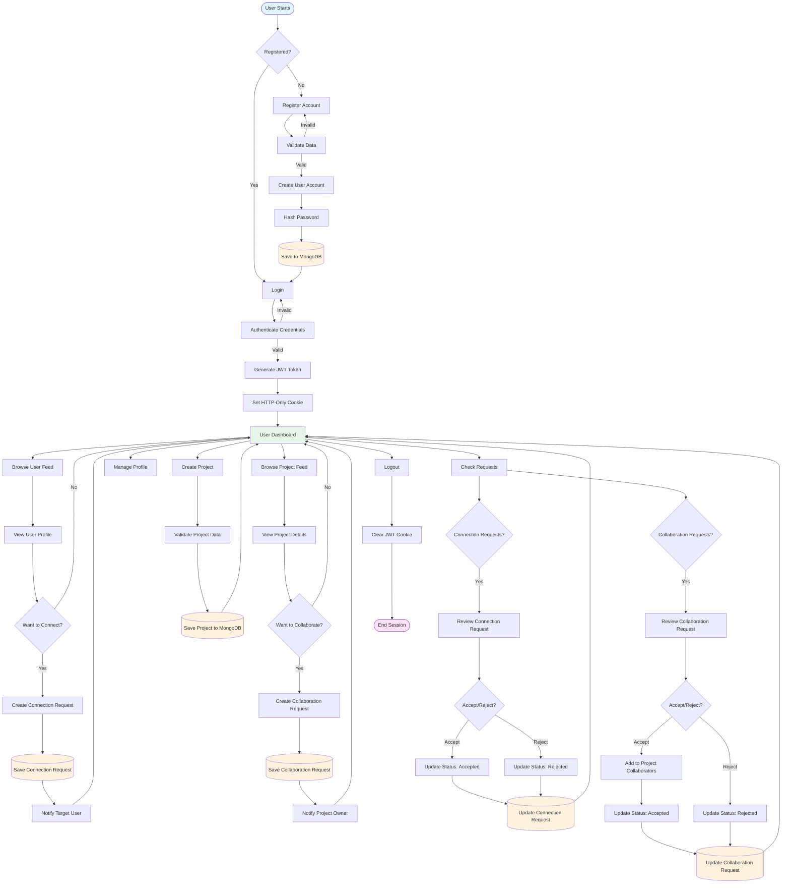

# PairUp Backend

A robust RESTful API backend for a collaboration platform that connects developers and creators, enabling them to collaborate on projects, build professional networks, and discover new opportunities.

## 🚀 Features

- **User Authentication & Management**
  - User registration and login with JWT-based authentication
  - Secure password hashing with bcrypt
  - User profile management with skills, professional titles, and bio
  - User feed for discovering other professionals

- **Project Management**
  - Create and manage projects with status tracking
  - Project categories and descriptions
  - Project feed for browsing available projects
  - Track project status (not started, in progress, finished, canceled)

- **Connection System**
  - Send connection requests to other users
  - Accept or reject connection requests
  - View your connections and pending requests
  - Build your professional network

- **Collaboration Requests**
  - Request collaboration on projects
  - Accept or reject collaboration requests
  - Manage your collaboration requests
  - Track project collaborators

## 📊 Application Flow



## 🛠️ Tech Stack

- **Runtime**: Node.js
- **Framework**: Express.js v5
- **Language**: TypeScript
- **Database**: MongoDB with Mongoose
- **Authentication**: JSON Web Tokens (JWT)
- **Password Security**: bcrypt
- **Validation**: validator.js
- **Code Quality**: Biome
- **Package Manager**: pnpm

## 📋 Prerequisites

Before you begin, ensure you have the following installed:

- [Node.js](https://nodejs.org/) (v18 or higher)
- [pnpm](https://pnpm.io/) (or npm/yarn)
- [MongoDB](https://www.mongodb.com/) (local instance or MongoDB Atlas account)

## 🔧 Installation

1. **Clone the repository**
   ```bash
   git clone <repository-url>
   cd pairUp-backend
   ```

2. **Install dependencies**
   ```bash
   pnpm install
   ```
   
   **Note**: Replace `your-secret-jwt-key-here` with a strong, random secret key for JWT token signing.

4. **Start the development server**
   ```bash
   pnpm dev
   ```

   The server will start on `http://localhost:3000`

## 📁 Project Structure

```
pairUp-backend/
├── src/
│   ├── config/
│   │   └── database.ts          # MongoDB connection configuration
│   ├── http/
│   │   └── controllers/
│   │       ├── middlewares/
│   │       │   └── auth.ts      # Authentication middleware
│   │       ├── projects/         # Project-related routes
│   │       ├── request-collabotation-in-project/  # Collaboration request routes
│   │       ├── request-connections/  # Connection request routes
│   │       └── users/            # User-related routes
│   ├── models/
│   │   ├── collaboration-request.ts
│   │   ├── connection-request.ts
│   │   ├── project.ts
│   │   └── user.ts
│   ├── types/
│   │   └── express.d.ts         # Express type definitions
│   ├── utils/
│   │   └── signup-data-validation.ts
│   └── server.ts                # Application entry point
├── .gitignore
├── package.json
├── pnpm-lock.yaml
└── README.md
```

## 🔌 API Endpoints

### User Routes

- `GET /feed` - Get user feed
- `POST /register` - Register a new user
- `POST /login` - User login
- `POST /logout` - User logout
- `GET /users/:userId` - Get user by ID
- `DELETE /users/:userId` - Delete user by ID
- `GET /me` - Get current user profile (authenticated)
- `PUT /me/edit` - Update user profile (authenticated)
- `PUT /me/edit-password` - Update user password (authenticated)

### Project Routes

- `GET /project/feed` - Get project feed
- `GET /project/:projectId` - Get project by ID
- `POST /project/create` - Create a new project (authenticated)
- `PUT /project/:projectId` - Update project information (authenticated)
- `GET /projects/my-projects` - Get current user's projects (authenticated)

### Connection Request Routes

- `POST /request/connection/send/:toUserId` - Send connection request (authenticated)
- `POST /request/connection/:status/:connectionId` - Reply to connection request (authenticated)
- `GET /request/connection/my-connections` - Get user's connections (authenticated)
- `GET /request/connection/my-requests` - Get connection requests (authenticated)

### Collaboration Request Routes

- `POST /collaboration/request/send/:projectId` - Send collaboration request (authenticated)
- `POST /collaboration/request/:status/:collaborationRequestId` - Reply to collaboration request (authenticated)
- `GET /collaboration/request/my-requests` - Get collaboration requests (authenticated)

## 🔐 Authentication

The API uses JWT (JSON Web Tokens) for authentication. After successful login, the JWT token is stored in an HTTP-only cookie. Protected routes require the `auth` middleware, which validates the JWT token.

**Token Expiration**: 7 days

## 📝 Data Models

### User
- Name, email, password
- Professional title, age, gender
- Photo URL, skills array, about section
- Timestamps (createdAt, updatedAt)

### Project
- Title, description, category
- Author ID, cover photo
- Status (not started, in progress, finished, canceled)
- Collaborators array
- Timestamps

### Connection Request
- From user ID, to user ID
- Status (pending, accepted, rejected)
- Timestamps

### Collaboration Request
- Collaborator ID, project ID
- Status (pending, accepted, rejected)
- Timestamps

## 🧪 Development

The project uses TypeScript with experimental type stripping for development. The dev server automatically restarts on file changes.

```bash
pnpm dev
```

## 🔒 Security Features

- Password validation (strong password requirements)
- Email validation
- Age validation (minimum 18 years)
- JWT token-based authentication
- Password hashing with bcrypt
- HTTP-only cookies for token storage

## 📄 License

ISC

## 👤 Author

**Mariano Capiliku**

---

For questions, issues, or contributions, please open an issue or submit a pull request.
